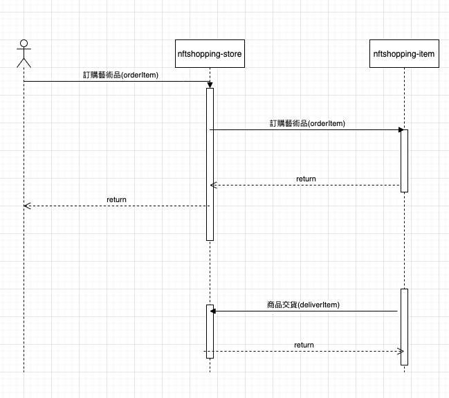

# NFT Shopping

## Table of Contents

* [專案描述](#專案描述)
* [Demo](#Demo)
* [執行智能合約](#執行智能合約)
* [Flow  Chart](#Flow Chart)

## 專案描述

### Creation合約功能
1. 發行功能
2. 交易功能
### Backend API
1. 商店管理(nftshopping-store-api)
2. 商品發行與交易管理(nftshopping-item-api)

## Demo
### Backend
#### API文檔
1. store 功能:http://storeapi.daiwanwei.xyz/swagger/index.html
2. item 功能:http://itemapi.daiwanwei.xyz/api-docs (暫時關閉)
#### API測試

##### 測試資料
1. 合約([rinkeby-scan](https://rinkeby.etherscan.io/address/0x73Eb55Ac4aa3157856B57B874FF9F94DDbf7F2C4)): 0x73Eb55Ac4aa3157856B57B874FF9F94DDbf7F2C4 
2. 藝術品ID: 618112af282ebd884918be7c
3. 品牌ID: @woooo


## 執行智能合約

### Installation
```shell
npm install
```

### Compile Smart Contract
```shell
npx hardhat compile
```

### Test Smart Contract
```shell
npx hardhat test
```

### Deploy Smart Contract(local)
```shell
npx hardhat node //啟動本地測試鏈
npx hardhat run scripts/creation.deploy.js --network localhost 
```

### Other
```shell
npx hardhat accounts
npx hardhat clean
npx hardhat help
```
## Flow Chart
#### 發行商品流程(需要先刊登藝術品)

